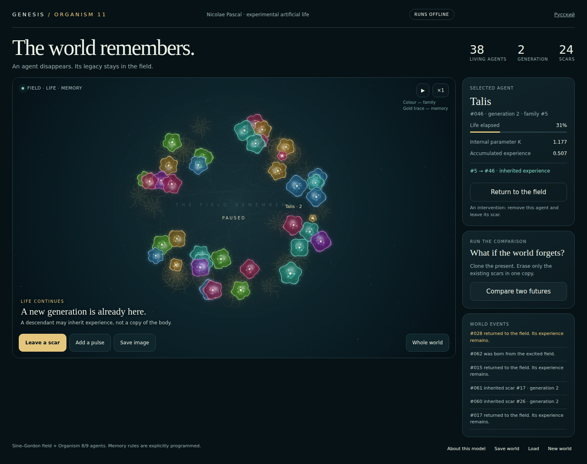

# GENESIS — Мир помнит

**Небольшая JavaScript-модель искусственной жизни: агент исчезает, а оставленная им память среды влияет на последующие рождения.**

Открой один HTML. Верни агента в поле. Увидь оставшийся след. Затем сделай две копии мира, сотри старые следы в одной и сравни продолжения при одинаковом внешнем шуме.

**[English](README.md) · [Подробная модель](docs/MODEL_RU.md) · [Воспроизводимый пример](examples/compare-memory.cjs)**



## Запуск

Скачай репозиторий и открой **`GENESIS_11_RU.html`** в браузере. Английская версия — **`index.html`**. Сервер, аккаунт, установка библиотек и ключ API не нужны.

Выбери агента и нажми **«Оставить след»**. Он исчезнет, но останется затухающий след с K, накопленным опытом и происхождением. Более позднее рождение в этой области может унаследовать часть параметров. Смерть не создаёт потомка безусловно.

**«Сравнить два будущих»** удаляет только существующие следы из одной копии текущего мира. Начальные поля и агенты одинаковые; внешний шум одинаковый. **Новые следы разрешены в обеих копиях.** Это не мир, навсегда лишённый памяти, против мира с памятью.

При открытии показано вычисленное состояние после 1600 тактов, а не вручную расставленные существа.

## Взять движок без картинки

`genesis_engine.js` работает отдельно от интерфейса, в Node.js и браузере, без внешних пакетов.

```js
const { World, memoryTrial } = require('./genesis_engine.js');
const world = new World({ seed: 7807 }).advance(1600);
const report = memoryTrial(world, 1800);
console.log(report.kept.newBirths);    // 56 в контрольном запуске
console.log(report.erased.newBirths);  // 53 в контрольном запуске
console.log(report.stateDifferent);   // true
```

Готовый пример для Node.js 22:

```bash
node examples/compare-memory.cjs
node test_genesis.js
```

Первый сохраняет полный `comparison.json`; второй выполняет проверки. Для другого начального мира: `node examples/compare-memory.cjs 123 1800`.

## Конкретная польза

Разработчик процедурного мира получает прототип наследования через память места. Исследователь искусственной жизни может поменять одно правило памяти и запустить парные продолжения. Автор визуального или музыкального проекта может использовать события рождения, смерти и наследования.

Навигации, обучения практическим навыкам, звука и интеграций с игровыми движками в этой версии нет. Показанная «накопленная опытность» — скаляр модели, не доказанная способность решать задачи.

## Контрольный пример

Seed `7807`; точка ветвления — такт `1600`; продолжение — `1800` тактов:

| Результат | Старые следы сохранены | Старые следы стёрты |
|---|---:|---:|
| Новых агентов | 56 | 53 |
| Рождений с наследованием | 42 | 36 |
| Живых агентов в конце | 42 | 40 |

В начале совпадают поле и 39 агентов; во второй копии удалены 23 старых следа. Таблица показывает влияние заданного механизма, а не пользу памяти вообще. **Больше рождений не обязательно лучше.**

В комплекте **20 автоматических проверок**: воспроизводимость, сохранение и продолжение, восемь заданных парных опытов и 20000 тактов контроля численной конечности. Результаты — в [evidence/test_results.json](evidence/test_results.json).

## Как устроена модель

На кольце развивается дискретное поле sine–Gordon с шумом и слабым демпфированием. Правила порога, пиков, расстояния и вероятности определяют рождения. У агента есть K, быстрая/медленная память согласованности, напряжение, страх, опыт и конечная жизнь. Смерть возбуждает поле и оставляет затухающий шрам. Шрам меняет порог рождения, выбор места и наследуемые параметры.

Это модель искусственной жизни с явно заданными правилами, не доказательство сознания, биологической жизни или физических солитонов. Художественный вид существ не является рассчитанной формой материальной частицы.

## Авторство и развитие

**Nicolae Pascal.** Продолжение ветки TPM / Organism 8–9. Для запуска знание TPM не требуется. Источники сохранены в [SOURCES.md](SOURCES.md), предложенные задачи — в [CONTRIBUTING.md](CONTRIBUTING.md).

Лицензия **CC BY 4.0** сохранена из исходного архива; [условия](LICENSE.md), [атрибуция и изменения](NOTICE.md). Код и оформление разрабатывались с помощью ИИ.
